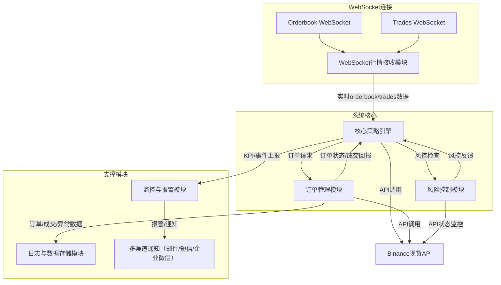

# 被动做市策略项目架构设计

## 🚀 v2.0 版本新特性

### 核心功能增强
- **定时撤单重置**: 定期清理订单池，重置订单管理器状态，避免订单堆积
- **改单功能**: 优先使用改单而非撤单+重新下单，显著减少rate limit使用
- **智能决策**: 根据价格偏差自动选择改单或撤单，优化操作效率
- **订单状态流转**: 完整的订单生命周期管理，包括PENDING_MODIFY状态

### 技术架构优化
- **改单工作器**: 独立的改单处理队列，支持并发改单操作
- **事件系统扩展**: 新增OrderResetEvent、OrderModifyEvent等事件类型
- **配置增强**: 支持改单阈值、重置间隔等新配置参数
- **演示完善**: 新增demo_order_management.py展示完整订单管理流程

### 性能提升
- **减少API调用**: 改单比撤单+重新下单减少50%+的API调用
- **更好的订单管理**: 定时重置避免订单状态混乱
- **异步处理**: 改单操作异步执行，提高系统响应速度

---

## 1. 策略概述

### 1.1 核心目标
本策略旨在为指定交易对提供专业级被动做市服务，通过在参考价格的**0.2%-0.4%**区间内持续提供高质量双向流动性，实现以下核心目标：

- **精准价差控制**：严格维持订单价格在参考价格±0.2%-0.4%区间内
- **持续流动性供应**：确保买卖双方始终各有≥2个有效订单（订单价值≥10U）
- **实时价格追踪**：毫秒级响应Binance现货行情变化，动态调整订单位置
- **成交风险最小化**：通过智能订单布局策略，最大化降低被动成交概率
- **高可用性保证**：订单有效性维持率>99.5%，系统延迟<50ms
- **智能订单管理**：优先使用改单，定期重置订单池，优化操作效率

### 1.2 关键绩效指标 (KPIs)
- **价差合规率**: 订单价格在0.2%-0.4%区间内的时间占比 > 99.8%
- **双边流动性维持率**: 买卖双方各有≥2个有效订单的时间占比 > 99.9%
- **订单深度达标率**: 符合最小订单价值要求(10U)的比例 > 99.95%
- **价格响应延迟**: 从检测到价格变化到完成订单调整的时间 < 100ms
- **被动成交率**: 订单被动成交的比例 < 0.5%
- **改单成功率**: 改单操作成功率 > 95% (v2.0新增)
- **重置频率**: 定时重置间隔5分钟，确保订单池清洁 (v2.0新增)

---

## 2. 系统架构设计

### 2.1 总体架构图
- **WebSocket行情接收模块** ←→ **核心策略引擎** ←→ **订单管理模块**
- **风险控制模块**、**监控与报警模块**、**日志与数据存储模块**贯穿全流程
- **原生WebSocket API**对接Binance实时数据流
- **改单工作器**、**定时重置任务**并行处理订单操作 (v2.0新增)

### 2.2 核心模块说明

#### 2.2.1 WebSocket行情接收模块 (BinanceWebSocketClient)
- **原生WebSocket连接**：直接连接Binance WebSocket API，无rate limit限制
- **双流监听**：同时监听orderbook和trades数据流
- **实时数据推送**：毫秒级推送最新价格、盘口深度至策略引擎
- **智能数据过滤**：只显示重要交易（>0.01 BTC或5秒间隔）
- **自动重连机制**：支持指数退避重连和异常处理
- **市场数据分析**：价格变化、价差分析、成交量统计、买卖流向分析

#### 2.2.2 核心策略引擎 (StrategyEngine.py) - v2.0增强
- 计算参考价格（如中间价、加权价等）
- 动态生成/调整买卖订单，确保价差、深度、数量等合规
- 智能订单布局，降低被动成交概率
- 订单撤单、下单逻辑优化，防止频繁操作
- **改单优先策略**：根据价格偏差自动选择改单或撤单 (v2.0新增)
- **智能决策算法**：优先使用改单，减少API调用频率 (v2.0新增)

#### 2.2.3 订单管理模块 (OrderManager.py) - v2.0增强
- 统一管理所有挂单、撤单、成交回报
- 订单状态实时同步，异常自动重试
- 支持批量下单、批量撤单
- 订单生命周期管理，自动清理已完成订单
- **定时撤单重置**：定期清理订单池，重置订单管理器 (v2.0新增)
- **改单功能支持**：支持订单价格和数量修改 (v2.0新增)
- **订单状态流转**：PENDING_MODIFY → ACTIVE → PENDING_CANCEL → CANCELLED (v2.0新增)

#### 2.2.4 风险控制模块 (RiskManager.py)
- 监控账户余额、持仓、API状态
- 订单异常、成交异常、API异常自动处理
- 触发风控阈值时自动降级或暂停策略
- 支持多级风险控制：持仓限制、价格波动、订单数量等

#### 2.2.5 执行引擎 (ExecutionEngine.py) - v2.0增强
- 异步订单执行，支持多工作器并行处理
- 速率限制和重试机制
- 订单状态实时更新
- 批量处理优化
- **改单工作器**：独立的改单处理队列 (v2.0新增)
- **改单重试机制**：改单失败自动重试 (v2.0新增)
- **改单速率限制**：防止改单操作过于频繁 (v2.0新增)

#### 2.2.6 事件总线 (EventBus.py) - v2.0增强
- 异步事件驱动架构
- 支持事件订阅/发布模式
- 多工作器并行处理事件
- 事件统计和监控
- **改单事件**：OrderModifyEvent、OrderModifySuccessEvent、OrderModifyFailureEvent (v2.0新增)
- **重置事件**：OrderResetEvent (v2.0新增)

#### 2.2.7 配置管理 (ConfigLoader.py, Configs.py) - v2.0增强
- 支持YAML/JSON配置文件
- 类型安全的配置对象
- 运行时配置验证
- **改单配置**：modify_threshold、max_modify_deviation等 (v2.0新增)
- **重置配置**：reset_interval、cleanup_interval等 (v2.0新增)

#### 2.2.8 交易所API (ExchangeAPI.py) - v2.0增强
- Binance REST API封装
- 支持签名认证
- 错误处理和重试机制
- 测试网/主网切换
- **改单API**：modify_order方法支持订单修改 (v2.0新增)

---

## 3. 代码实现细节

### 3.1 核心数据结构

#### OrderState (OrderState.py) - v2.0增强
```python
@dataclass
class OrderState:
    order_id: str
    client_order_id: str
    symbol: str
    side: str
    price: Decimal
    original_quantity: Decimal
    executed_quantity: Decimal
    status: OrderStatus
    create_time: float
    update_time: float
    last_event_time: float
    # v2.0新增字段
    modification_count: int = 0
    last_modify_time: float = 0.0
```

#### 事件系统 (EventType.py) - v2.0增强
```python
class EventType(Enum):
    MARKET_TRADE = auto()
    MARKET_DEPTH = auto()
    PRICE_UPDATE = auto()
    ORDER_STATUS = auto()
    PLACE_ORDER = auto()
    CANCEL_ORDER = auto()
    RISK_WARNING = auto()
    EMERGENCY_STOP = auto()
    # v2.0新增事件类型
    ORDER_MODIFY = auto()
    ORDER_MODIFY_SUCCESS = auto()
    ORDER_MODIFY_FAILURE = auto()
    ORDER_RESET = auto()
```

#### WebSocket客户端 (BinanceWebSocketClient)
```python
class BinanceWebSocketClient:
    def __init__(self, symbol: str):
        self.symbol = symbol.lower()
        self.orderbook_ws = None
        self.trades_ws = None
        self.orderbook_data = None
        self.trades_data = []
        self.reconnect_attempts = 0
        self.max_reconnect_attempts = 5
        self.last_trade_print = 0
        self.trade_print_interval = 5  # 每5秒最多打印一次trades
        self.significant_trade_threshold = Decimal('0.01')  # 只打印大于0.01 BTC的交易
```

### 3.2 关键算法

#### 参考价格计算 (ReferencePriceEngine.py)
- **TWAP**: 时间加权平均价格
- **VWAP**: 成交量加权平均价格  
- **Hybrid**: 混合算法（TWAP 60% + VWAP 40%）
- **实时中间价**: 基于WebSocket orderbook的实时中间价格

#### 订单决策算法 (StrategyEngine.py) - v2.0增强
```python
# 价格偏差检查
price_deviation = abs(order.price - reference_price) / reference_price

# v2.0新增：改单优先策略
if price_deviation <= self.max_modify_deviation:
    # 改单决策
    decisions.append(ModifyOrderDecision(
        order_id=order.order_id,
        new_price=new_price,
        new_quantity=new_quantity
    ))
else:
    # 撤单决策
    decisions.append(CancelOrderDecision(order_id=order.order_id))
```

#### 改单算法 (ExecutionEngine.py) - v2.0新增
```python
async def _execute_modify_order(self, task):
    try:
        # 调用交易所API改单
        response = await self.exchange_api.modify_order(
            order_id=task.order_id,
            new_price=task.new_price,
            new_quantity=task.new_quantity
        )
        
        # 更新订单状态
        await self.order_manager.apply_modification(
            order_id=task.order_id,
            new_price=task.new_price,
            new_quantity=task.new_quantity
        )
        
        # 发布改单成功事件
        await self.event_bus.publish(OrderModifySuccessEvent(...))
        
    except Exception as e:
        # 改单失败，发布失败事件
        await self.event_bus.publish(OrderModifyFailureEvent(...))
```

#### 定时重置算法 (OrderManager.py) - v2.0新增
```python
async def _reset_orders_periodically(self):
    while True:
        try:
            await asyncio.sleep(self.reset_interval)
            
            # 取消所有活跃订单
            active_orders = self.get_orders_by_status(OrderStatus.ACTIVE)
            for order in active_orders:
                await self.cancel_order(order.order_id)
            
            # 发布重置事件
            await self.event_bus.publish(OrderResetEvent(
                timestamp=time.time(),
                cancelled_count=len(active_orders)
            ))
            
            print(f"🔄 定时重置完成，取消 {len(active_orders)} 个订单")
            
        except Exception as e:
            print(f"❌ 定时重置失败: {e}")
```

#### 风险控制算法 (RiskManager.py)
```python
# 持仓风险检查
if abs(current_position) > max_position:
    trigger_emergency_measures()
    
# 价格波动检查
price_change = abs(last_price - previous_price) / previous_price
if price_change > max_price_change:
    trigger_risk_warning()
```

#### WebSocket数据处理算法
```python
# 智能数据过滤
if (trade_volume >= self.significant_trade_threshold or 
    current_time - self.last_trade_print >= self.trade_print_interval):
    print(f"💱 重要成交 - {trade_side}: {format_price(trade_price)} × {format_quantity(trade_volume)}")
    self.last_trade_print = current_time

# 市场数据分析
def get_market_summary(self):
    prices = list(market_data['price_history'])
    spreads = list(market_data['spread_history'])
    volumes = list(market_data['volume_history'])
    
    price_change = (prices[-1] - prices[-2]) / prices[-2]
    avg_spread = sum(spreads) / len(spreads)
    volatility = sum(abs(recent_prices[i] - recent_prices[i-1]) 
                    for i in range(1, len(recent_prices))) / len(recent_prices)
```

### 3.3 性能优化

#### 异步处理
- 全异步架构，基于asyncio
- 事件驱动，非阻塞IO
- 多工作器并行处理
- **改单工作器**：独立的改单处理队列 (v2.0新增)

#### WebSocket优化
- **原生WebSocket连接**：绕过CCXT限制，直接连接Binance API
- **双流并行监听**：orderbook和trades同时监听，提高数据完整性
- **智能数据过滤**：减少噪音，提高可读性
- **自动重连机制**：指数退避重连，提高连接稳定性

#### 速率限制 (RateLimiter.py) - v2.0增强
```python
class RateLimiter:
    def __init__(self):
        self.order_limits = {}
        self.modify_limits = {}  # v2.0新增：改单速率限制
        self.cancel_limits = {}
```

#### 内存管理
- 订单自动清理机制
- 交易数据滑动窗口
- 事件队列大小限制

---

## 4. 关键技术点

### 4.1 WebSocket实现优势
- **无Rate Limit限制**：WebSocket持续连接，不受API调用频率限制
- **更高效率**：减少网络开销，更低的延迟，更少的CPU使用
- **更丰富数据**：Orderbook深度数据、实时成交数据、价格变化追踪
- **智能数据过滤**：只显示重要交易，减少噪音，提高可读性

### 4.2 WebSocket连接管理
```python
# Orderbook流
wss://stream.binance.com:9443/ws/btcusdt@depth20@100ms

# Trades流  
wss://stream.binance.com:9443/ws/btcusdt@trade
```

### 4.3 其他技术要点
- **高性能异步IO**：采用异步框架（如Python asyncio、Go协程等）实现毫秒级行情与订单处理
- **低延迟行情通道**：优先使用WebSocket直连，必要时多点冗余
- **订单簿快照与增量同步**：保证盘口数据一致性
- **智能订单算法**：动态调整订单价格、数量，规避主动成交
- **高可用与容错**：多进程/多节点部署，自动重启与故障转移

---

## 5. 风险控制与合规
- 订单价格、数量、频率均设有风控阈值
- 账户余额、API权限实时监控
- 异常自动降级、暂停，防止资金损失
- WebSocket连接异常自动重连和降级处理

---

## 6. 监控与报警
- 实时KPI采集与展示（可对接Prometheus/Grafana）
- 关键事件自动报警，支持多渠道推送
- 日志与数据可追溯，便于问题定位
- WebSocket连接状态监控和异常报警

---

## 7. 开发与部署建议
- 推荐使用Python/Go等高性能异步语言
- 核心模块解耦，便于扩展与维护
- 支持Docker容器化部署，便于快速上线与回滚
- 单元测试、集成测试全覆盖，保障系统稳定性
- 预留多交易对、多账户扩展能力
- WebSocket连接池管理，支持多实例部署

---

## 8. 代码质量与测试

### 8.1 代码结构
```
MM_Logic/
├── main.py                    # 主程序入口
├── demo_binance_spot.py       # Fetch方式演示
├── demo_binance_websocket.py  # WebSocket方式演示
├── demo_binance_native_websocket.py      # 原生WebSocket演示
├── demo_binance_websocket_optimized.py   # 优化WebSocket演示
├── src/                       # 核心模块
│   ├── core/                  # 核心组件
│   │   ├── events/           # 事件系统
│   │   └── orders/           # 订单管理
│   ├── strategy/             # 策略引擎
│   ├── execution/            # 执行引擎
│   ├── risk/                 # 风险管理
│   ├── market/               # 市场数据
│   ├── config/               # 配置管理
│   └── utils/                # 工具函数
├── tests/                    # 单元测试
├── docs/                     # 项目文档
├── requirements.txt           # 依赖管理
└── config.yaml               # 配置文件
```

### 8.2 依赖管理
```python
# 核心依赖
asyncio          # 异步编程
aiohttp          # HTTP客户端
websockets       # WebSocket客户端
ccxt             # 交易所API
pyyaml           # YAML配置
decimal          # 精确数值计算
dataclasses      # 数据类
enum             # 枚举类型
```

### 8.3 演示程序对比

#### Fetch方式 (demo_binance_spot.py)
- 使用CCXT fetch_ticker轮询
- 受rate limit限制
- 数据更新有延迟
- 适合低频场景

#### WebSocket方式 (demo_binance_websocket_optimized.py)
- 原生WebSocket连接
- 无rate limit限制
- 实时数据推送
- 智能数据过滤
- 适合高频场景

---

## 9. 执行思路总结
1. 明确目标与KPI，细化各项指标
2. 搭建WebSocket行情接收、订单、风控、监控等核心模块
3. 实现高性能WebSocket行情接收与订单管理
4. 开发智能订单算法，动态调整订单
5. 完善风险控制与异常处理机制
6. 部署监控与报警系统，保障高可用
7. 持续优化性能与稳定性，定期复盘与升级

---

## 系统流程图



---

## 10. WebSocket vs Fetch 对比总结

### ✅ **WebSocket方式的优势**

1. **无Rate Limit限制**
   - WebSocket持续连接，不受API调用频率限制
   - 实时数据流，无需轮询

2. **更高的效率**
   - 减少网络开销：长连接vs频繁HTTP请求
   - 更低的延迟：实时推送vs轮询延迟
   - 更少的CPU使用：事件驱动vs主动查询

3. **更丰富的数据**
   - Orderbook深度数据：完整的买卖盘信息
   - 实时成交数据：每笔交易的详细信息
   - 价格变化追踪：历史数据分析和趋势

4. **智能数据过滤**
   - 只显示重要交易（>0.01 BTC或5秒间隔）
   - 减少噪音，提高可读性
   - 市场摘要和交易流向分析

### 🔧 **技术实现要点**

1. **WebSocket连接管理**
   ```python
   # Orderbook流
   wss://stream.binance.com:9443/ws/btcusdt@depth20@100ms
   
   # Trades流  
   wss://stream.binance.com:9443/ws/btcusdt@trade
   ```

2. **数据过滤逻辑**
   ```python
   # 只显示重要交易
   if (trade_volume >= self.significant_trade_threshold or 
       current_time - self.last_trade_print >= self.trade_print_interval):
   ```

3. **市场数据分析**
   ```python
   # 价格波动性计算
   volatility = sum(abs(recent_prices[i] - recent_prices[i-1]) 
                   for i in range(1, len(recent_prices))) / len(recent_prices)
   ```

---

> 本文档为被动做市策略项目的架构设计与执行思路，适用于专业量化团队快速落地与迭代。最新版本已集成WebSocket实现，提供更高效、更实时的市场数据获取能力。 