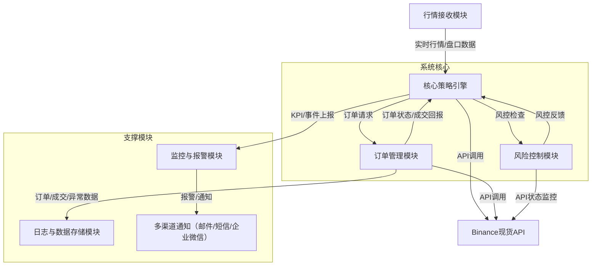

# 被动做市策略项目架构设计

## 1. 策略概述

### 1.1 核心目标
本策略旨在为指定交易对提供专业级被动做市服务，通过在参考价格的**0.2%-0.4%**区间内持续提供高质量双向流动性，实现以下核心目标：

- **精准价差控制**：严格维持订单价格在参考价格±0.2%-0.4%区间内
- **持续流动性供应**：确保买卖双方始终各有≥1个有效订单（订单价值≥10000U）
- **实时价格追踪**：毫秒级响应Binance现货行情变化，动态调整订单位置
- **成交风险最小化**：通过智能订单布局策略，最大化降低被动成交概率
- **高可用性保证**：订单有效性维持率>99.5%，系统延迟<50ms

### 1.2 关键绩效指标 (KPIs)
- **价差合规率**: 订单价格在0.2%-0.4%区间内的时间占比 > 99.8%
- **双边流动性维持率**: 买卖双方各有≥1个有效订单的时间占比 > 99.9%
- **订单深度达标率**: 符合最小订单价值要求(10000U)的比例 > 99.95%
- **价格响应延迟**: 从检测到价格变化到完成订单调整的时间 < 100ms
- **被动成交率**: 订单被动成交的比例 < 0.5%

---

## 2. 系统架构设计

### 2.1 总体架构图
- **行情接收模块** ←→ **核心策略引擎** ←→ **订单管理模块**
- **风险控制模块**、**监控与报警模块**、**日志与数据存储模块**贯穿全流程
- **API接口层**对接Binance现货API

### 2.2 核心模块说明

#### 2.2.1 行情接收模块 (MarketDataGateway.py)
- 实时订阅Binance现货WebSocket行情（Ticker/OrderBook）
- 毫秒级推送最新价格、盘口深度至策略引擎
- 支持自动重连和异常处理
- 维护最近100笔交易数据用于价格计算

#### 2.2.2 核心策略引擎 (StrategyEngine.py)
- 计算参考价格（如中间价、加权价等）
- 动态生成/调整买卖订单，确保价差、深度、数量等合规
- 智能订单布局，降低被动成交概率
- 订单撤单、下单逻辑优化，防止频繁操作

#### 2.2.3 订单管理模块 (OrderManager.py)
- 统一管理所有挂单、撤单、成交回报
- 订单状态实时同步，异常自动重试
- 支持批量下单、批量撤单
- 订单生命周期管理，自动清理已完成订单

#### 2.2.4 风险控制模块 (RiskManager.py)
- 监控账户余额、持仓、API状态
- 订单异常、成交异常、API异常自动处理
- 触发风控阈值时自动降级或暂停策略
- 支持多级风险控制：持仓限制、价格波动、订单数量等

#### 2.2.5 执行引擎 (ExecutionEngine.py)
- 异步订单执行，支持多工作器并行处理
- 速率限制和重试机制
- 订单状态实时更新
- 批量处理优化

#### 2.2.6 事件总线 (EventBus.py)
- 异步事件驱动架构
- 支持事件订阅/发布模式
- 多工作器并行处理事件
- 事件统计和监控

#### 2.2.7 配置管理 (ConfigLoader.py, Configs.py)
- 支持YAML/JSON配置文件
- 类型安全的配置对象
- 运行时配置验证

#### 2.2.8 交易所API (ExchangeAPI.py)
- Binance REST API封装
- 支持签名认证
- 错误处理和重试机制
- 测试网/主网切换

---

## 3. 代码实现细节

### 3.1 核心数据结构

#### OrderState (OrderState.py)
```python
@dataclass
class OrderState:
    order_id: str
    client_order_id: str
    symbol: str
    side: str
    price: Decimal
    original_quantity: Decimal
    executed_quantity: Decimal
    status: OrderStatus
    create_time: float
    update_time: float
    last_event_time: float
```

#### 事件系统 (EventType.py)
```python
class EventType(Enum):
    MARKET_TRADE = auto()
    MARKET_DEPTH = auto()
    PRICE_UPDATE = auto()
    ORDER_STATUS = auto()
    PLACE_ORDER = auto()
    CANCEL_ORDER = auto()
    RISK_WARNING = auto()
    EMERGENCY_STOP = auto()
```

### 3.2 关键算法

#### 参考价格计算 (ReferencePriceEngine.py)
- **TWAP**: 时间加权平均价格
- **VWAP**: 成交量加权平均价格  
- **Hybrid**: 混合算法（TWAP 60% + VWAP 40%）

#### 订单决策算法 (StrategyEngine.py)
```python
# 价格偏差检查
price_deviation = abs(order.price - reference_price) / reference_price
if price_deviation > drift_threshold:
    # 撤销偏离过大的订单
    
# 智能订单位置
optimal_bid_price = reference_price * (1 - max_spread * 0.8)
optimal_ask_price = reference_price * (1 + max_spread * 0.8)
```

#### 风险控制算法 (RiskManager.py)
```python
# 持仓风险检查
if abs(current_position) > max_position:
    trigger_emergency_measures()
    
# 价格波动检查
price_change = abs(last_price - previous_price) / previous_price
if price_change > max_price_change:
    trigger_risk_warning()
```

### 3.3 性能优化

#### 异步处理
- 全异步架构，基于asyncio
- 事件驱动，非阻塞IO
- 多工作器并行处理

#### 速率限制 (RateLimiter.py)
```python
class RateLimiter:
    def __init__(self, max_requests_per_second: int):
        self.max_requests = max_requests_per_second
        self.request_times = deque()
```

#### 内存管理
- 订单自动清理机制
- 交易数据滑动窗口
- 事件队列大小限制

---

## 4. 关键技术点
- **高性能异步IO**：采用异步框架（如Python asyncio、Go协程等）实现毫秒级行情与订单处理
- **低延迟行情通道**：优先使用WebSocket直连，必要时多点冗余
- **订单簿快照与增量同步**：保证盘口数据一致性
- **智能订单算法**：动态调整订单价格、数量，规避主动成交
- **高可用与容错**：多进程/多节点部署，自动重启与故障转移

---

## 5. 风险控制与合规
- 订单价格、数量、频率均设有风控阈值
- 账户余额、API权限实时监控
- 异常自动降级、暂停，防止资金损失

---

## 6. 监控与报警
- 实时KPI采集与展示（可对接Prometheus/Grafana）
- 关键事件自动报警，支持多渠道推送
- 日志与数据可追溯，便于问题定位

---

## 7. 开发与部署建议
- 推荐使用Python/Go等高性能异步语言
- 核心模块解耦，便于扩展与维护
- 支持Docker容器化部署，便于快速上线与回滚
- 单元测试、集成测试全覆盖，保障系统稳定性
- 预留多交易对、多账户扩展能力

---

## 8. 代码质量与测试

### 8.1 代码结构
```
MM_Logic/
├── strategy_main.py          # 主程序入口
├── ConfigLoader.py           # 配置加载器
├── Configs.py               # 配置数据结构
├── EventBus.py              # 事件总线
├── EventType.py             # 事件类型定义
├── MarketDataGateway.py     # 行情数据网关
├── ReferencePriceEngine.py  # 参考价格引擎
├── StrategyEngine.py        # 策略引擎
├── OrderManager.py          # 订单管理器
├── OrderState.py            # 订单状态管理
├── ExecutionEngine.py       # 执行引擎
├── RiskManager.py           # 风险管理器
├── ExchangeAPI.py           # 交易所API
├── RateLimiter.py           # 速率限制器
├── OrderAnalysis.py         # 订单分析
├── OrderDecision.py         # 订单决策
├── ExecutionTask.py         # 执行任务
├── RiskConfig.py            # 风险配置
├── RiskLevel.py             # 风险等级
└── 项目架构设计.md           # 项目文档
```

### 8.2 依赖管理
```python
# 核心依赖
asyncio          # 异步编程
aiohttp          # HTTP客户端
websockets       # WebSocket客户端
pyyaml           # YAML配置
decimal          # 精确数值计算
dataclasses      # 数据类
enum             # 枚举类型
```

---

## 9. 执行思路总结
1. 明确目标与KPI，细化各项指标
2. 搭建行情、订单、风控、监控等核心模块
3. 实现高性能行情接收与订单管理
4. 开发智能订单算法，动态调整订单
5. 完善风险控制与异常处理机制
6. 部署监控与报警系统，保障高可用
7. 持续优化性能与稳定性，定期复盘与升级

---

## 系统流程图



---

> 本文档为被动做市策略项目的架构设计与执行思路，适用于专业量化团队快速落地与迭代。 